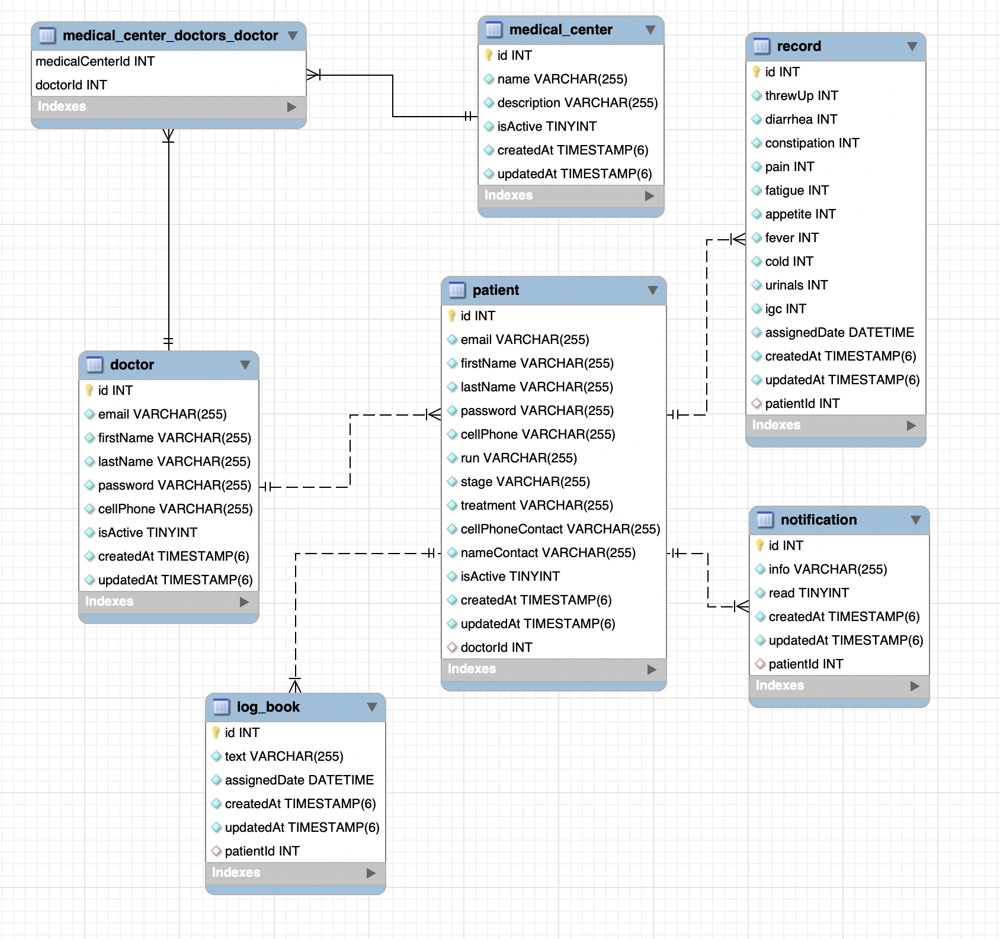

<p align="center">
  <a href="http://nestjs.com/" target="blank"></a>
</p>

[travis-image]: https://api.travis-ci.org/nestjs/nest.svg?branch=master
[travis-url]: https://travis-ci.org/nestjs/nest
[linux-image]: https://img.shields.io/travis/nestjs/nest/master.svg?label=linux
[linux-url]: https://travis-ci.org/nestjs/nest

## Description

- The endpoints grouped in App Patient, are with security based on jwt
- The endpoints grouped in App Doctor, are with security based on jwt
- All the other endpoints will be occupied in the following phases by administrative apps or to manipulate the information easily in development.
- Users share a unique login with the flag is Patient, to indicate what type of user is
- To create a patient associated with a doctor, use the endpoint found in App Doctor
- All endpoints are functional

## Installation

```bash
$ npm install
```

## Running the app

```bash
# development
$ npm run start

# watch mode
$ npm run start:dev

# production mode
$ npm run start:prod
```

## Dependencies

- Docker

```bash
# docker
$ docker-compose up -d
```

### Todo docker-compose

- Config data persistence

## Model



## License

Nest is [MIT licensed](LICENSE).
